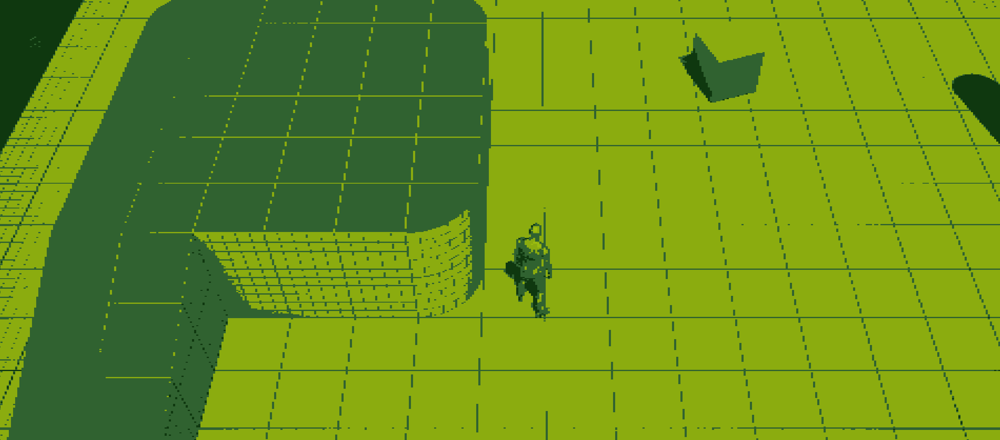
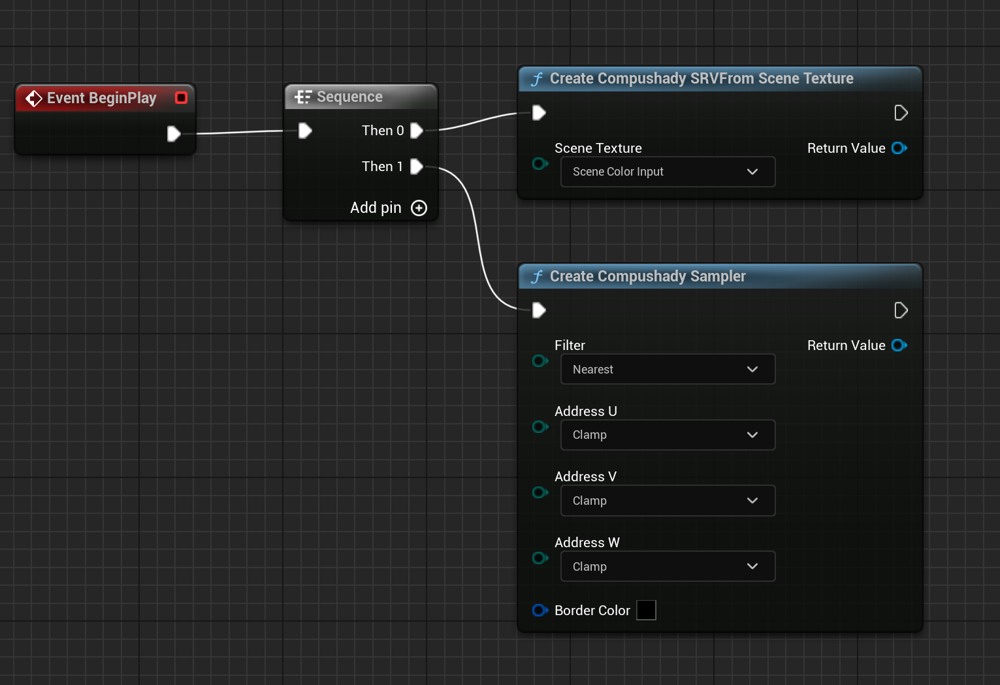
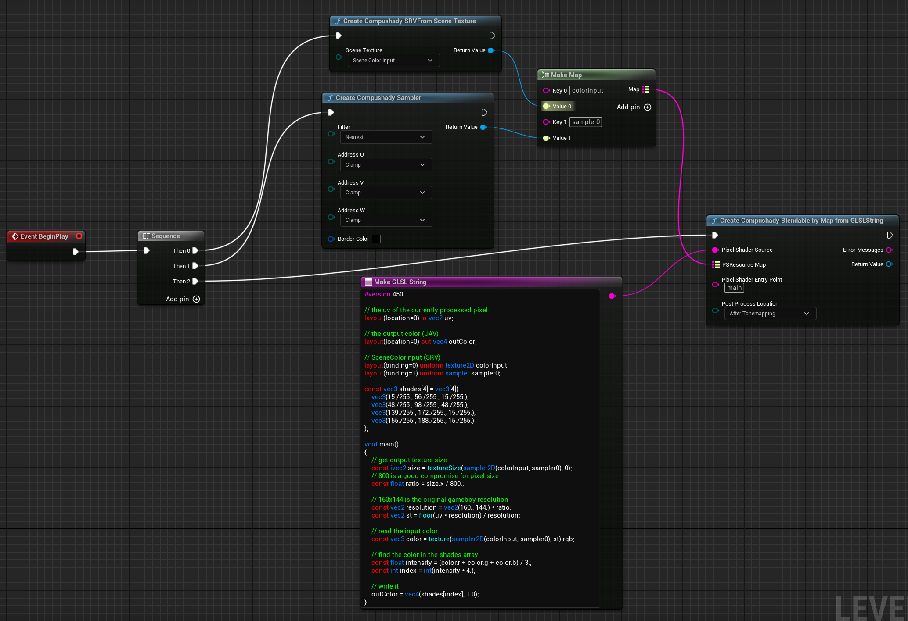
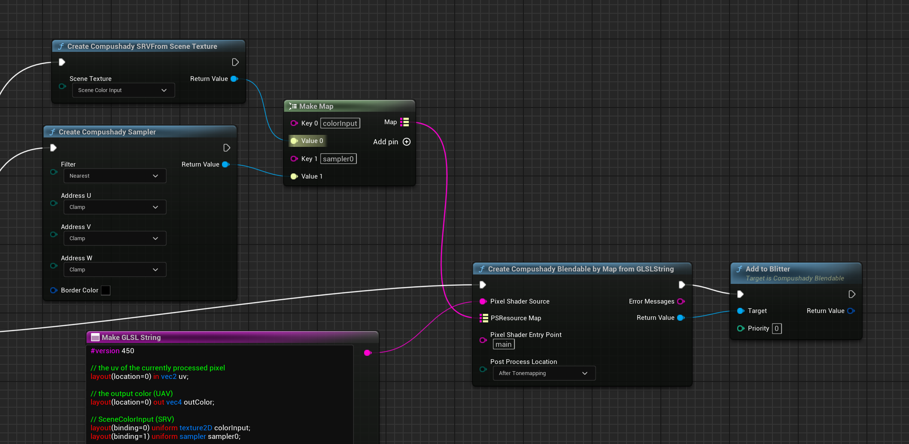
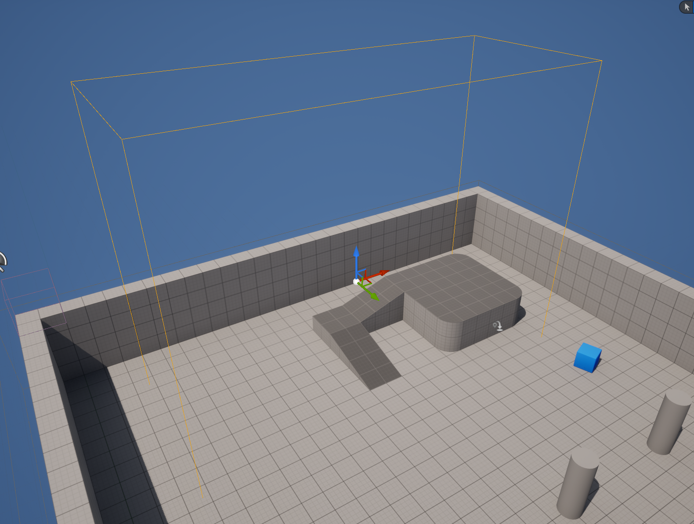
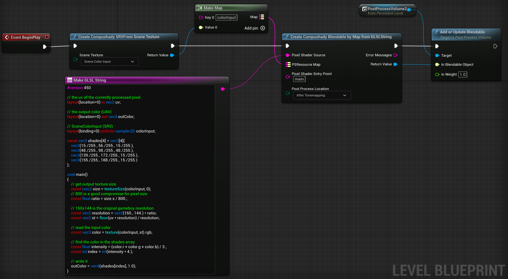

# Applying a GameBoy PostProcessing filter

In this tutorial we are going to create a PostProcessing shader (in both GLSL and HLSL) that will be applied to the Game Viewport.



I am using the TopDown official Epic template for it, but you can use any level you want.

The code is based on this shadertoy shader: https://www.shadertoy.com/view/MlfBR8 (set one of the available videos as iChannel0, like the Van Damme one, and have fun)

## The Shader (GLSL)

```glsl
#version 450

// the uv of the currently processed pixel
layout(location=0) in vec2 uv;

// the output color (UAV)
layout(location=0) out vec4 outColor;

// SceneColorInput (SRV)
layout(binding=0) uniform texture2D colorInput;
layout(binding=1) uniform sampler sampler0;

const vec3 shades[4] = vec3[4](
    vec3(15./255., 56./255., 15./255.),
    vec3(48./255., 98./255., 48./255.),
    vec3(139./255., 172./255., 15./255.),
    vec3(155./255., 188./255., 15./255.)
);

void main()
{
    // get output texture size
    const ivec2 size = textureSize(sampler2D(colorInput, sampler0), 0);
    // 800 is a good compromise for pixel size
    const float ratio = size.x / 800.; 

    // 160x144 is the original gameboy resolution
    const vec2 resolution = vec2(160., 144.) * ratio;
    const vec2 st = floor(uv * resolution) / resolution;
    
    // read the input color
	const vec3 color = texture(sampler2D(colorInput, sampler0), st).rgb;
    
    // find the color in the shades array
    const float intensity = (color.r + color.g + color.b) / 3.;
    const int index = int(intensity * 4.);
    
    // write it
    outColor = vec4(shades[index], 1.0);
}
```

When writing postprocessing shader with Compushady, you need to get the UV of the currently processed pixel (they are available in the location 0 of the fragment/pixel shader) and, eventually one of the Scene Textures (Color, GBuffers, Depth, Stencil...) with the related Sampler (the filter for reading the texture values)

## Running the PostProcess effect on the Viewport

In this example we need just the ColorInput (this is the current result of the various passes of the renderer) and a Sampler (with point/nearest filtering and clamp addressing mode):



Now we can create the Compushady Blendable object (Blendables are pipelines, generally compute or rasterizer, that are executed automatically at every frame and combined with the renderer passes):

Note how we mapped the SRV of the SceneColorInput to the colorInput shader variable/resource. 



(Eventually connect the ErrorMessages pin to a PrintString node to get error messages, if any)

The blendable is ready, and we can now attach it to the viewport or to a PostProcess Volume.

Attaching to a Viewport is super easy thanks to The Blitter:



You can now play the Level and enjoy.

## Running the PostProcess effect on a PostProcess Volume:

Instead of applying the effect to the whole viewport, we can configure a PostProcess Volume that triggers the effect whenever the current camera enters its volume.

The first step is defining the PostProcess Volume by adding it to the level and defining its Brush settings (the goal here is to activate the effect when the characters moves over the ramp):



Then by adding a reference to the PostProcess Volume in the Level Blueprint, we can attach the Compushady Blendable to it:



Now the effect will trigger as soon as the mannequin steps over the ramp, and will be turned off when the camera exits the volume.

## HLSL Variant
