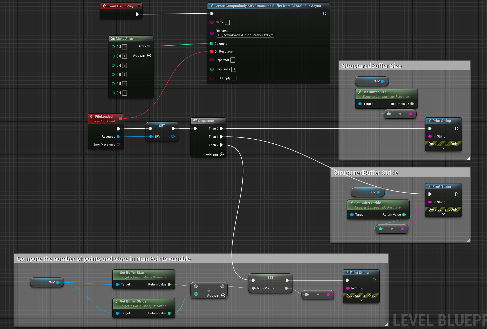

# Rendering PointClouds

This tutorial will show how to use the rasterizer and the blitter to render pointclouds (in XYZ/ASCII format) with both points and billboard quads.

The XYZ/ASCII format will be gzipped to show how Compushady con decompress and upload to the gpu on the fly (in asynchronous/nonblocking mode).

The tutorial will use HLSL for both the Vertex and Pixel shaders, but at the end of the tutorial you will find the GLSL variant.

## Step0: loading the data in a StructuredBuffer

For this tutorial we are going to use the Denver Union Station (https://en.wikipedia.org/wiki/Denver_Union_Station) pointcloud by Trimble Inc. (https://www.trimble.com/en) that you can download (in gzipped XYZ format) from here: https://github.com/rdeioris/compushady-assets/raw/main/UnionStation.txt.gz


The file contains one point per line, with each line exposing 6 relevant columns (space separated): X, Y, Z, R, G and B

For loading those data in a GPU StructuredBuffer, we need to instruct the Compushady GZIP ASCII Async loader on how to build the follwing structure:

```c
struct Point
{
    float x;
    float y;
    float z;
    float r;
    float g;
    float b;
};
```

This is pretty straightforward:



Most of the nodes are just for debugging/printing the resulting size and stride of the buffer as well as the number of points in the cloud (that is just the ratio between size and stride).

The node/function ```CreateCompushadySRVStructuredBufferFromGZASCIIFileAsync``` is non-blocking so it will trigger the "FileLoaded" custom event as soon as the file is loaded and parsed.

Note: the PointCloud is pretty big, it may require around 10 seconds to be fully loaded

Columns is an array with the index of columns (6 in this case) to includem while Separator (left empty here) means "split every line of the file by space"

If the file is loaded correctly you will end with the following numbers:

StructuredBuffer Size: 152553480

StructuredBuffer Stride: 24 (6 floats: x, y, z, r, g, b)

NumPoints: 6356395 (152553480 / 24)

## Step1: rendering points

Rendering the points requires to define the VertexShader we want to run for every point and the related PixelShader.

To be integrated with the Unreal Engine rendering system, we need to have access to the camera and projection matrix (that we are going to store in a CBV).

Those two infos are exposed by the Compushady Blendable system, but first let's define the Vertx Shader:

```hlsl
// SRV
struct Point
{
    float x;
    float y;
    float z;
    float r;
    float g;
    float b;
};
StructuredBuffer<Point> points;

// CBV
struct Config
{
    matrix view;
    matrix projection;
};
ConstantBuffer<Config> config;

// this will be passed to the PixelShader
struct PSInput
{
    float4 position : SV_Position;
    float4 color: COLOR;
};

PSInput main(const uint vid : SV_VertexID)
{
    // extract the point
    float3 xyz = float3(-points[vid].x, points[vid].y, points[vid].z) * 100;

    // extract the color (and normalize it)
    float3 color = float3(points[vid].r / 255.0, points[vid].g / 255.0, points[vid].b / 255.0);

    // get the point in view/camera space
    float4 view_space = mul(config.view, float4(xyz, 1));

    PSInput o;
    // project the point
    o.position = mul(config.projection, view_space);
    // pass the color to the PixelShader
    o.color = float4(color, 1);
    return o;
}
```

the related PixelShader will be pretty simple (and boring):

```hlsl
struct PSInput
{
    float4 position : SV_Position;
    float4 color: COLOR;
};

float4 main(PSInput i) : SV_Target0
{
    return i.color;
}
```

The Blueprint will be a bit more complex than before:


* Remove the two previous print nodes (we only need the NumPoints computation)
* Create a new CBV for storing the two matrices (i have set the size to 256, we actually need 128 bytes for 2 matrices, but we are preparing it for the future implementations)
* Add the ```CreateCompushadyAdvancedBlendableByMapFromHLSLString``` node (from now on the "AdvancedBlendable" node)
* Create the HLSL strings for the Vertex and Pixel shader and connect them to the "AdvancedBlendable"
* Create a Map for "config" (assigned to the CBV) and "points" (assigned to the SRV) and connect it to the "AdvancedBlendable"
* Set the Rasterizer configuration to use the Depth buffer (Check Depth), use the PointsList as the PrimitiveType and "Always" as the BlendMode.
* Set the Rasterizer configuration to copy the View Matrix to CBV offset 0 and the Projection Matrix to CBV offset 64 (a matrx requires 64 bytes to be stored)
* Set the NumVertices pin of the "AdvancedBlendable" to NumPoints and NumInstaces to 1.
* Set the PostProcessLocation of the "AdvancedBlendable" to "PrePostProcess"
* Finally connect the "AdvancedBlendable" to the "AddToBlitter" node

We are ready to render:


## Step1.1: some additional note

You may have noticed the ```float3 xyz = float3(-points[vid].x, points[vid].y, points[vid].z) * 100;``` line in the vertex shader.

It deserves some more explanation:

* The cloud has been created using Z-up, Y-forward, X-right convention, so (given that Unreal uses X-forward) we are inverting the X to avoid the "mirror-effect" (remove the minus sign to better understand).
* The 100 multiplication is to correct the scale (as the cloud is in meters while Unreal is in centimeters)

Regarding colors, ```float3 color = float3(points[vid].r / 255.0, points[vid].g / 255.0, points[vid].b / 255.0);``` the 255 division is required as the XYZ file stores the colors channels as 8bit integers.

We are using int64 as the type for NumPoints. This is actually useless as the max number of drawable vertices is a 32bits signed value.

The Depth test is very important even if we are drawing points: without it overlapping points will result in total mess.

## Step2: moving to quads

## Optional Step 3: storing the shaders in a file

## Optional Step 4: using GLSL
