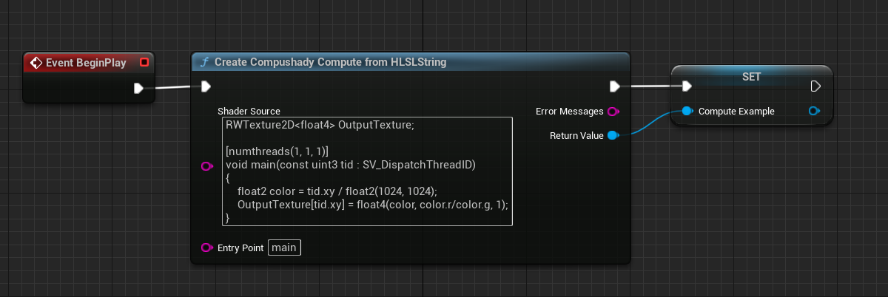
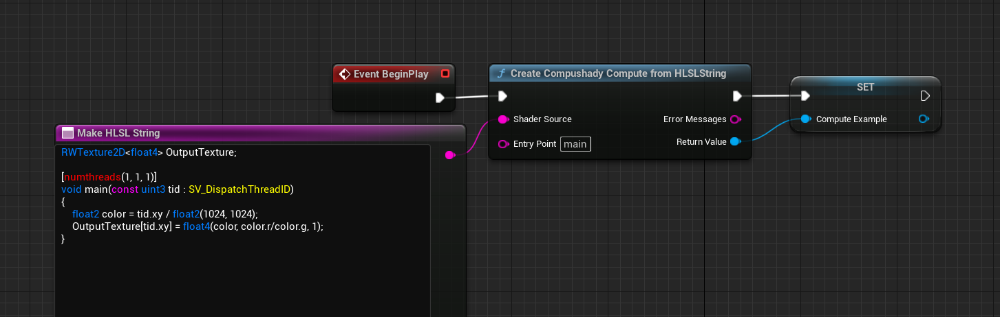
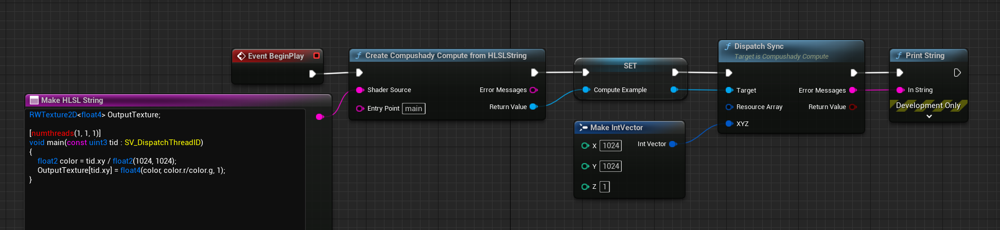
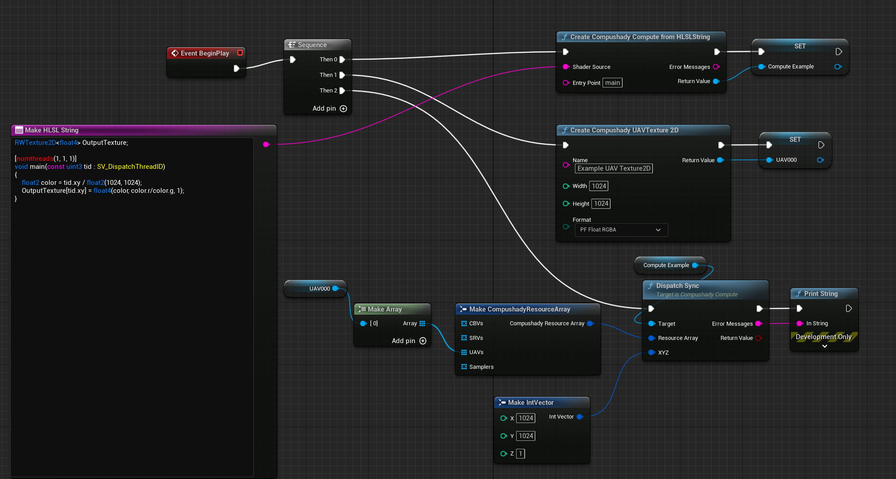
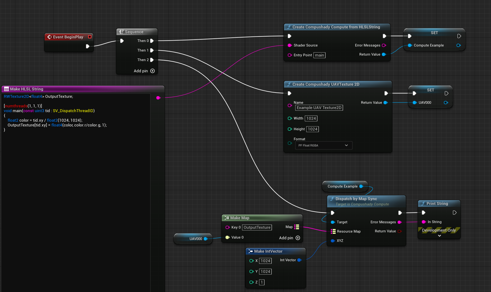
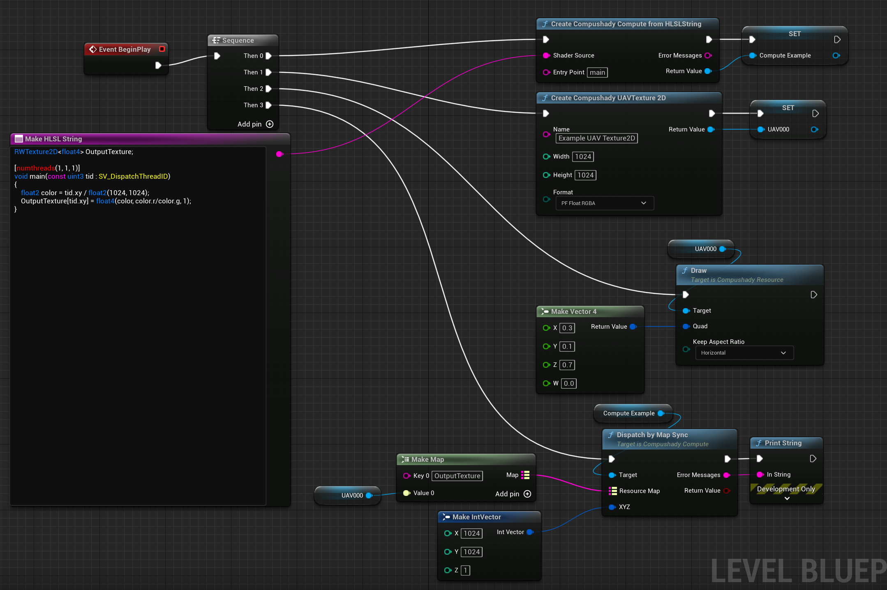
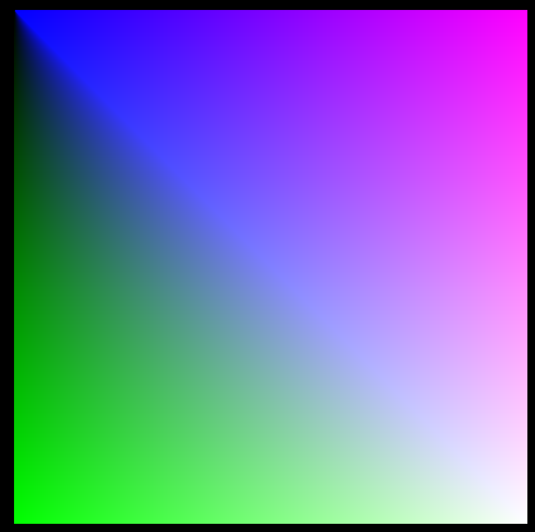
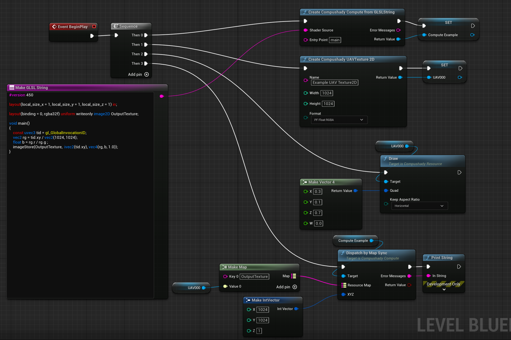
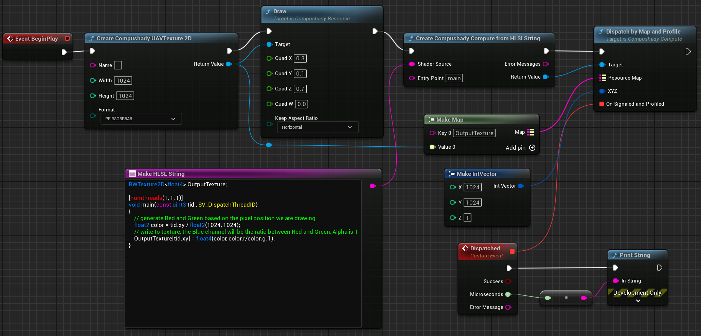
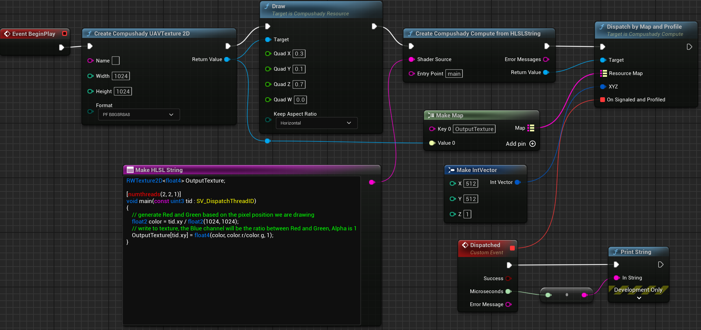

# CompushadyUnreal
Compushady for Unreal Engine 5

## Intro

Compushady is an Unreal Engine 5 plugin aimed at easily (and quickly) executing GPU shaders. 

The plugin exposes features like runtime shaders loading (from strings/bytearrays, files or assets), conversion and compilation (HLSL and GLSL are supported, but if you are brave enough you can assemble from SPIRV too), reflection, fast copies (for both Textures and Buffers) and integration with various Unreal features (from postprocessing to raytracing to video encoding) and assets (like MediaTextures, Curves, DataTables...).

The common use case is to optimize highly parallelizable problems using compute shaders, but you can integrate runtime shaders programming to generate motion graphics and even audio (yes, you can pipe the the audio output to a shader or generate waveforms from a shader!). The shadertoy website is always a good source for amazing ideas: https://www.shadertoy.com/ (Note: if you are on this page because you want to run shadertoy shaders on unreal, you can jump to the relevant section: [ShaderToy](#ShaderToy-Integration))

Another focus is on scientific data processing, so native support for formats like TIFF and NRRD or plain text files like CSV or pointcloud XYZ is available.
 
Currently Windows (D3D12 and Vulkan), Linux and Android (Vulkan) are supported. Mac and iOS (Metal) are currently in development.

Like the homonym python module (this plugin is a porting of its APIs), it makes heavy use of the DirectXShaderCompiler project (https://github.com/Microsoft/DirectXShaderCompiler) as well as the various Khronos projects for SPIRV management.

Join the Discord server for support: https://discord.gg/2WvdpkYXHW

## Quickstart (step0, Glossary)

Let's start with a glossary:

* `Shader`: a program (that you can write in various specific languages) that can be executed by the GPU
* `HLSL`: a high level shading language from Microsoft (you can write your shaders in this language)
* `GLSL`: a high level shading language from Khronos (you can write your shaders in this language)
* `SPIRV`: a low level shading language from Khronos (you can write your shaders in this language/assembly but it is very unpractical, higher level languages can compile to SPIRV)
* `DXIL`: a low level shading language from Microsoft (limited support on Compushady, some higher level languages, mostly HLSL, can compile to DXIL)
* `Bindable`: a "view" over a "resource" (buffers, textures, ...) that can be accessed by a shader. CBV, SRV, UAV and Samplers are all Bindables. 
* `CBV`: Constant Buffer View, it represents a tiny block (generally no more than 4096 bytes) of constantly changing data (like per-frame if you are genrating graphics) accessible by a shader.
* `SRV`: Shader Resource View, it represents potentially big readonly data in the form of buffers (raw bytes) or textures.
* `UAV`: Unordered Access View, it represents potentially big read/write data in the form of buffers (raw bytes) or textures.
* `Samplers`: blocks of configuration defining the filtering and addressing mode when reading pixels from textures.
* `Compute`: A compute shader, composed by a shader and a set of 0 or more CBV, SRV, UAV or samplers. You use Compute for running generic task on a GPU
* `Rasterizer`: A Vertex + Pixel/Fragment Shader or Mesh + Pixel/Fragment Shader (where supported) with a set of 0 or more RTV (see below), CBV, SRV, UAV or Samplers and 0 or 1 DSV (see below). You use a Rasterizer for drawing triangles, lines and points using the GPU.
* `RTV`: Render Target View, a texture to which the Rasterizer (see below) can write to
* `DSV`: Depth Stencil View, a texture containing the depth and the stencil buffers. The Rasterizer can optionally write to it.
* `Blitter`: a Compushady subsystem for quickly drawing textures on the screen or applying post processing effects

## Quickstart (step1, Compute Shader with HLSL)

We can now write our first Compute Shader (we will use HLSL) to generate a simple texture with a color gradient.

```hlsl
RWTexture2D<float4> OutputTexture;

[numthreads(1, 1, 1)]
void main(const uint3 tid : SV_DispatchThreadID)
{
    // generate Red and Green based on the pixel position we are drawing
    float2 color = tid.xy / float2(1024, 1024);
    // write to texture, the Blue channel will be the ratio between Red and Green, Alpha is 1
    OutputTexture[tid.xy] = float4(color, color.r/color.g, 1);
}
```

We can now use this shader code to create a new Compute Pipeline (you can do this in the Level Blueprint on a completely empty level):



The shader code in the screenshot has been brutally pasted in the "Shader Source" pin, but this is ugly and very hard to read and maintain. A very handy Blueprint node
is the MakeHLSLString:



This node will provide you with a better editor and (more important) syntax highlighting.

The ```ComputeExample``` variable now contains the Compute Pipeline ready to execute.

Before running it, it is worthy to analyze the code:

Let's ignore ```[numthreads(1, 1, 1)]``` for now. The goal is to run this code one time per pixel (the texture will be 1024x1024, so the shader will run 1048576 times).

How do we know in the code which pixel (x and y) we are processing?

This is the job of variables marked with ```semantics``` (attributes that intruct the GPU on how to fill those special variables). In this case the ```SV_DispatchThreadID``` semantic is setting the x, y, z of the pixel
we are currently processing in the ```tid``` constant ```uint3``` (a vector of 3 unsigned integers in HLSL). Why 3 values? This is how compute shaders work, you specify how much iterations to run in the form of a 3-dimensional space,
so x=5, y=10, z=2 will run the shader 100 times (5 * 10 * 2) and the variable marked as ```SV_DispatchThreadID``` will always contains the current iteration (x, y, z) values.

For running the Compute Shader, we will call the ```DispatchSync``` function with the number of XYZ iterations (1024, 1024, 1):



The ```Error Messages``` pin is connected to a ```Print String``` as we are going to get an error (just play the level):

```Expected 1 UAVs got 0```

Our shader requires to write to a texture (RWTexture2D<float4> OutputTexture), but we have not specified it!

An RWTexture2D describe a writable bidimensional texture, so (given the previous Glossary) we need a UAV mapped to a 1024x1024 texture.

Let's create it:



Lot of new stuff here: we have created (with the ```CreateCompushadyUAVTexture2D``` node) a new Texture2D with the specified size (1024x1024) and pixel format (Float RGBA, means half precision float [16 bits] per channel) and mapped it to a new UAV (named UAV000 here). We gave a name to the new texture ("Example UAV Texture2D") to allow it to be recognizable in the various Unreal debug tools (like the "Render Resource Viewer"). Giving name to resources is totally optional but higly suggested.

In addition to creating the new UAV/Texture2D we need to "bind" it to the shader when we run it. The ```CompushadyResourceArray``` is a structure for binding "Bindables" (CBV, SRV, UAV and Samplers) to a Pipeline.

It is pretty simple to use but requires the user to specify the resources in the order they are defined in the shader. In this example we have a single resource (OutputTexture), so the task is easy, but we may have dozens of resources,
and the various optimizers could even remove them from the code (if the yare not used), so it is way more handy to use names instead of indices:



The ```DispatchByMapSync``` node allows to bind resources by using the same name specified in the code instead of computing they position in an array.

If we play the level we should not get errors anymore. But where is our texture?

Textures resides in GPU memory. Showing them to your monitor (or using them in a material) is a different story. Lucky enough Compushady includes a ready to use subsystem for quickly (and easily) drawing stuff on the screen, called ```The Blitter```.



By using the ```Draw``` function over a Resource, you can draw it on the screen. The Quad structures allows you to define where to drw the texture in normalized coordinates (0,0 on top-left, 1,1 on bottom-right). The Horizontal flag allows to automatically adjust
the height (the W here) based on the horizontal aspect ratio of the resource and the screen:

After playing the Level this will be the result:



## Quickstart (step2, GLSL)

The same example can be done using GLSL instead of HLSL:

```glsl
#version 450

layout(local_size_x = 1, local_size_y = 1, local_size_z = 1) in;

layout(binding = 0, rgba32f) uniform writeonly image2D OutputTexture;

void main()
{
    const uvec3 tid = gl_GlobalInvocationID;
    vec2 rg = tid.xy / vec2(1024, 1024);
    float b = rg.r / rg.g ;
    imageStore(OutputTexture,  ivec2(tid.xy), vec4(rg, b, 1.0));
}
```



GLSL has no semantics, instead it makes use of global variables (you recognize them by the gl_ prefix) like the ```gl_GlobalInvocationID```.

It is required to specify the version of the language on the very top (```#version 450```).

The ```layout(local_size_x = 1, local_size_y = 1, local_size_z = 1) in;``` is the equivalent of HLSL ```[numthreads(1, 1, 1)]``` (check next section)

Note: while the node allows to specify an entry point for the function name, the GLSL standard mandates that function to always be called "main".

## Quickstart (step3, Defining the number of threads)

This section requires a bit of understanding on how GPU scheduling works:

GPUs run tasks over what are commonly called "waves" (or workgroups). Each wave runs the same code on different cores in parallel (the amount of cores per wave is GPU specific, but generally 32 on NVidia and 64 on AMD).

When you schedule a Compute Shader to the GPU you specify how many times that shader must be executed: the XYZ value of the Dispatch functions.

By doing X * Y * Z (1024 * 1024 * 1) we now know that we are scheduling the execution of our shader 1048576 times (each of those execution is known as a 'ThreadGroup').

It may looks impressive, but looking at it from the "wave" point of view we are underutilizing our GPU: each of those 1048576 ThreadGroups is scheduled to a different wave.

It means (on an NVidia card) that 31 of our 32 per-wave cores are doing nothing.

Our goal is to activate the other wave cores, and we can do this by specifying on how many "threads" each 'ThreadGroup' will be executed.

To specify it we have the ```[numthreads(X, Y, Z)]``` attribute on HLSL and ```layout(local_size_x = Z, local_size_y = Y, local_size_z = Z) in;```

Note that specyfing the amount of ThreadGroups (the XYZ argument of Dispatch) and the number of threads per group using 3 dimensions is just a handy way for dealing with common graphics-related problems. At the end
we are dealing with a single dimension value (1024 * 1024 * 1 maps to 1048576)

Befor starting tuning are amount of threads per group, let's profile our current shader to have some measure of the execution time (we can use the DispatchByMapAndProfile function)



DispatchByMapAndProfile is the first Asynchronous/Nonblocking function we are using (more on this later), it will basically runs the Compute Shader in background without blocking the Game Thread. 

Its "Microseconds" parameter returns how much time the Compute Shader required to complete its task.

By running it multiple times you should get a series of pretty stable numbers (around 600 in my testing machine).

Let's try increasing the number of threads per group to (2, 2, 1):



Note that in addition to setting numthreas to 2, 2, 1 (4 threads per group, 2 * 2 * 1) you need to reduce the number of ThreadGroups (as now each one is able to process 4 pixels).

Quick table:

* 1048576 pixels with 1 thread per ThreadGroup: XYZ = (1024, 1024, 1) and numthreads(1, 1, 1)
* 1048576 pixels with 4 threads per ThreadGroup: XYZ = (512, 512, 1) and numthreads(2, 2, 1)
* 1048576 pixels with 8 threads per ThreadGroup: XYZ = (256, 512, 1) and numthreads(4, 2, 1)
* 1048576 pixels with 32 threads per ThreadGroup: XYZ = (256, 128, 1) and numthreads(4, 8, 1)
* 1048576 pixels with 1024 threads per ThreadGroup: XYZ = (32, 32, 1) and numthreads(32, 32, 1)

By running our shader with ```numthreads(2, 2, 1)``` the microseconds will decrease to around 170, with ```numthreads(4, 2, 1)``` we are around 80 and with ```numthreads(4, 8, 1)``` we reach an astonishing 23!

NOTE: it is up to the GPU to split the threads in a group between waves, you can generally ignore those inner mechanisms.

In addition to the SV_DispatchThreadID (and the GLSL gl_GlobalInvocationID) we have those other semantics/globalvariables available:

* SV_GroupID (gl_WorkGroupID in GLSL): The ThreadGroup Index (it is related to the XYZ of the Dispatch, so if your XYZ is 1, 2, 1 the SV_GroupID can be 0, 0, 0 or 0, 1, 0
* SV_GroupIndex (gl_LocalInvocationIndex in GLSL): The monodimensional representation of SV_GroupID, so if your XYZ is 2, 2, 2 the value can go from 0 to 7 (from (0 * 0 * 0) to (2 * 2 * 2) -1 )
* SV_GroupThreadID (gl_LocalInvocationID in GLSL): The Thread ID into a ThreadGroup (so it is related to numthreads(), with [numthreads(1, 1, 2)] it can be 0, 0, 0, or 0, 0, 1)

In addition to the increased parallelism it is worth noting that tasks in the same ThreadGroup can have access to a tiny amount (generally 32k) of special shared memory. Check the specific tutorial for examples.

## Quickstart (step4, Rendering to Unreal textures/materials)

## Quickstart (step5, Asynchronous/Nonblocking mode)

## Quickstart (step6, Configuration with CBVs)

## Quickstart (step7, Saving to files)

## Quickstart (step8, Samplers)

## Quickstart (step9, C++)

## Quickstart (step10, Postprocessing Effects)

## Docs

* Compute shaders

* Rasterizer

* Audio

* Postprocessing

* Raytracing

* Video Encoding (H264/H265)

## Tutorials

* Volumetric Rendering a NNRD file
* Generating chiptunes
* Gameboy-like postprocess
* ISF effects
* GroupShared memory

## The Blitter

## ShaderToy integration

## API
